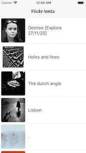
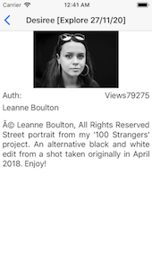
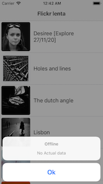
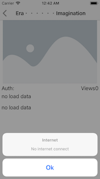

  

# Lenta IOS
This project demonstrates my ability to develop applications in Swift + rest api

*Libs*
- only Swift std

Capabilities:
- Load data from Flickr api
- Cache data for offline mode
- 2 Screen tableView and detail

**Offline Mode**

